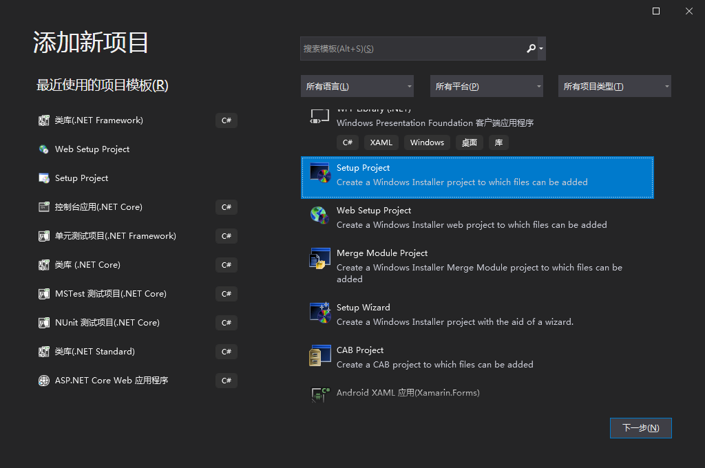
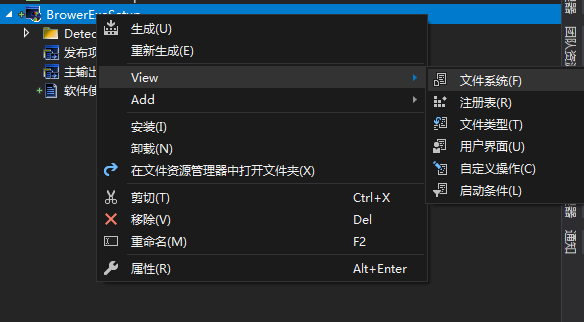
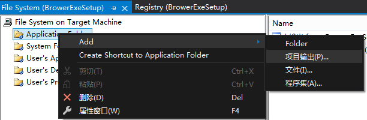
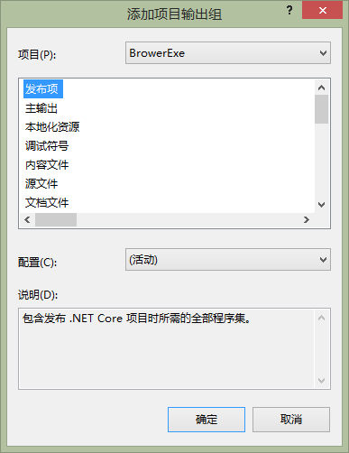
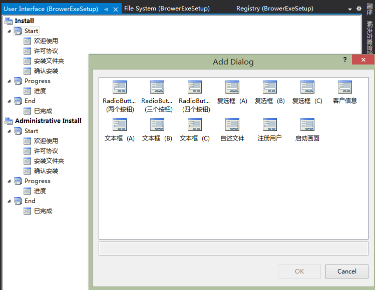
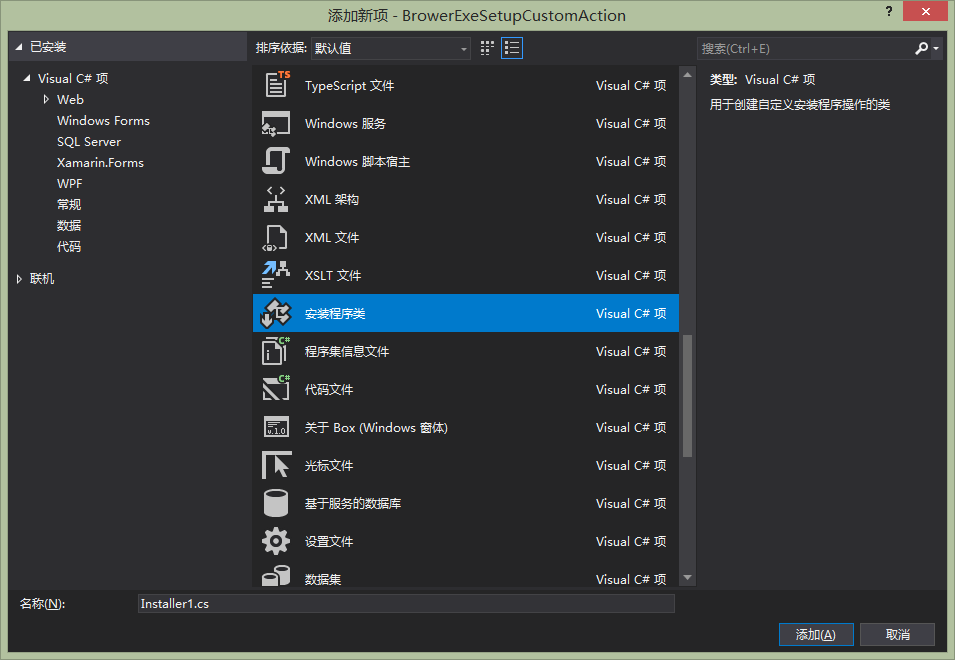

# 程序安装项目

## 新增程序安装项目

新增项目，选择【SetUp Project】，添加程序安装项目:

> **注意**
>
> 如果没有【SetUp Project】则在VS扩展中添加【Microsoft Visual Studio Installer Project】扩展。VS2017在【工具】=>【扩展和更新】中添加扩展。VS2019直接在菜单栏的【扩展】中添加扩展

## 设置要安装的项目

在项目的文件系统中的【Application Folder】中鼠标右键，选择【Add】=>【项目输出】，选择要安装的项目。

## 设置安装步骤

在用户界面中可以添加框架提供的安装步骤：

## 自定义操作

开发人员可以在安装、安装完成、撤回、卸载时自定义自己的操作。

实现方法：

1. 新建一个类库
2. 在类库中添加【安装程序类】，在该类中实现自己的操作
3. 在【文件系统】中添加该项目输出
4. 在【自定义操作】中添加我们的自定义操作

新增安装程序类：

