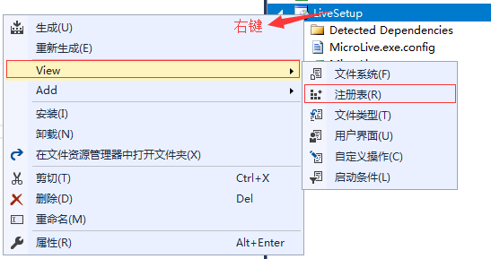

# 浏览器调用本地exe应用程序

* exe 创建注册表
* web启动exe应用程序
  
## exe 创建注册表

### 方法一、注册表文件格式如下

```txt
Windows Registry Editor Version 5.00
[HKEY_CLASSES_ROOT\Micro.Live]
"URL Protocol"="C:\\Micro.Live.exe"
@="Micro.Live.Protocol"
[HKEY_CLASSES_ROOT\Micro.Live\DefaultIcon]
@="C:\\Micro.Live.exe,1"
[HKEY_CLASSES_ROOT\Micro.Live\shell]
[HKEY_CLASSES_ROOT\Micro.Live\shell\open]
[HKEY_CLASSES_ROOT\Micro.Live\shell\open\command]
@="\"C:\\Micro.Live.exe\"\"%1\""
```

复制到（txt）记事本，然后另存为Micro.Live.reg.reg文件，打开运行文件；

### 方法二、控制台程序（C#）如下：

1. 配置文件（ProtocolInfo.xml）放到本地程序目录（Debug）

    ```xml
    <?xml version="1.0" encoding="utf-8" ?> 
    <ArrayOfProtocolInfo xmlns:xsd="http://www.w3.org/2001/XMLSchema" xmlns:xsl="http://www.w3.org/2001/XMLSchema-instance">
    <ProtocolInfo ProtocolName="Micro.Live.Protocol" ProgramName="Micro.Live.exe" NodeName="Micro.Live" />
    </ArrayOfProtocolInfo>
    ```

2. 创建控制台应用程序

    ```C#
    try
    {
        List<ProtocolInfo> protocalInfos = ProtocolInfo.GetProtocolInfo(string.Format("{0}\\ProtocolInfo.xml", Environment.CurrentDirectory));
        if (protocalInfos == null || protocalInfos.Count == 0)
            Console.WriteLine("未获取协议的配置信息！请确保配置文件 ProtocolInfo.xml 在当前目录下。");
        string nodeName = protocalInfos[0].NodeName;
        string programFullPath = string.Format("{0}\\{1}", Environment.CurrentDirectory, nodeName);
    
        RegistryKey key = Registry.ClassesRoot;
        string a = (string)key.GetValue(nodeName, true);
        if (!key.Name.Contains(nodeName))
        {
            RegistryKey software = key.CreateSubKey(protocalInfos[0].NodeName);
            software.SetValue("URL Protocol", programFullPath);
            software.SetValue("", protocalInfos[0].ProtocolName);
    
            RegistryKey softwareDefaultIcon = software.CreateSubKey("DefaultIcon");
            softwareDefaultIcon.SetValue("", string.Format("{0},{1}", programFullPath, 1));
    
            RegistryKey softwareShell = software.CreateSubKey("shell");
            softwareShell = softwareShell.CreateSubKey("open");
            softwareShell = softwareShell.CreateSubKey("command");
            softwareShell.SetValue("", string.Format("\"{0}\" \"%{1}\"", programFullPath, 1));
        }
    }
    catch(Exception ex)
    {
        Console.Write(ex.Message);
    }
    ```

3. 如果当前用户没有管理员权限，写注册表会被拒。程序需要添加app.manifest文件

### 方式三、部署添加注册表（C#）如下



注册表页面，各个节点的键值为：

键（Key|名称（Name）|值（Value）
:--|:--|:--
Micro.Live||Micro.Live.Protocol
Micro.Live|URL Protocol|C:\Micro.Live.exe
Micro.Live/DefaultIcon|URL Protocol|C:\Micro.Live.exe,1
Micro.Live/shell||
Micro.Live/shell/open||
Micro.Live/shell/open/command||"C:\Micro.Live.exe""%1"
